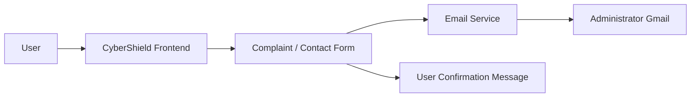
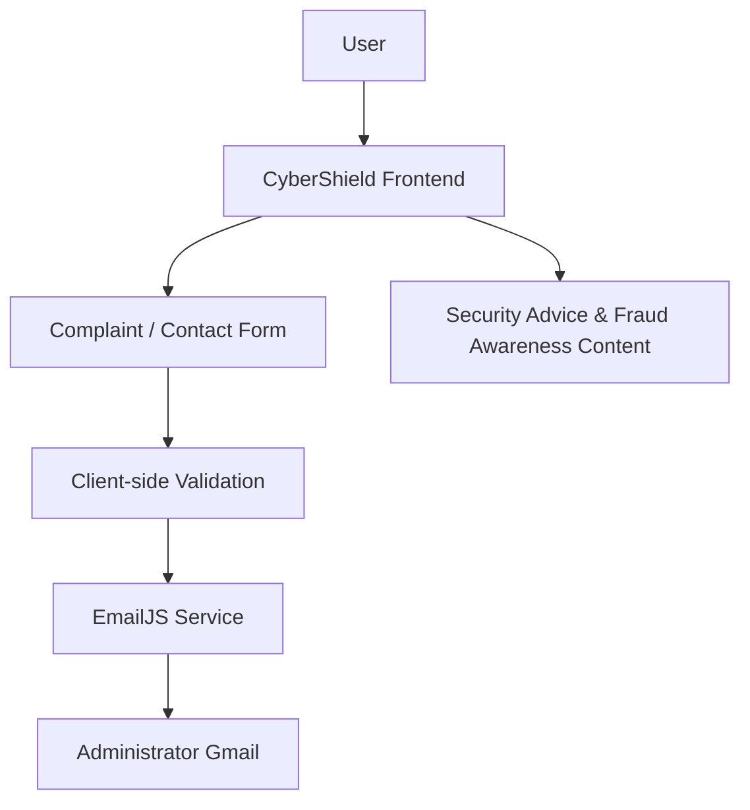

<div align="center">

# 🛡️ CyberShield

### *Report. Protect. Stay Secure.*

A cybersecurity complaint reporting and awareness platform built to make reporting digital-security incidents simpler, more accessible, and more understandable. CyberShield helps users document concerns such as phishing, scams, account compromise, cyberbullying, privacy issues, suspicious messages, and malware—while providing practical safety guidance.


<br />

**Building safer digital experiences, one report at a time.**

</div>

***

## 📌 Project Overview

CyberShield is a student-built cybersecurity web platform focused on awareness and accessible incident reporting. It addresses a common challenge: people often recognize that something online is suspicious but may not know how to document it, what information to preserve, or what immediate safety steps to take.

The platform is intended for users who want to report a cybersecurity-related concern and learn basic protective practices. Users can submit incident details through a structured complaint form, while the project administrator receives submissions through an email notification workflow.

> CyberShield is designed as an educational and portfolio project—not as an official cybercrime reporting service.

***

## ✨ Key Features

| Feature | Description |
|---|---|
| 📝 **Cybersecurity complaint reporting** | Structured reporting form for digital-security incidents |
| 📧 **Email-based notification** | Complaint and contact submissions can be forwarded to the project administrator through EmailJS |
| 💡 **Security guidance** | Practical advice for safer online behavior and account protection |
| 🎣 **Phishing reporting** | Report fake websites, deceptive links, and suspicious emails |
| 💳 **Online scam / fraud reporting** | Document payment scams, fraudulent offers, and suspicious transactions |
| 🔓 **Account security incidents** | Report compromised or hacked accounts |
| 🚨 **Cyberbullying / harassment** | Report abusive, threatening, or harmful online activity |
| 🔒 **Privacy and data concerns** | Report suspected data exposure or misuse of personal information |
| 📱 **Social media security** | Guidance and reporting support for social-platform concerns |
| 🦠 **Malware / suspicious software** | Report suspicious downloads, files, apps, or device behavior |
| 📱 **Responsive interface** | Designed to adapt across desktop, tablet, and mobile screens |
| 🧭 **Guided user flow** | Cover page → user details → dashboard → reporting and awareness sections |

***

## ⚙️ How It Works

```text
User
  ↓
Visits CyberShield
  ↓
Chooses “Report a Complaint”
  ↓
Completes the Incident Report Form
  ↓
Submission Is Processed
  ↓
Email Notification Is Generated
  ↓
Administrator Receives the Complaint
  ↓
User Sees a Submission Confirmation
```



***

## 🗂️ Complaint Categories

| Category | Examples |
|---|---|
| 🎣 **Phishing** | Fake websites, credential-stealing links, impersonation emails |
| 💳 **Online Scam / Fraud** | Fraudulent offers, payment scams, fake sellers, investment scams |
| 🔓 **Account Security** | Hacked, compromised, or unauthorized account access |
| 🚨 **Cyberbullying** | Online harassment, threats, abuse, impersonation |
| 🔒 **Privacy / Data Concerns** | Data exposure, privacy violations, misuse of personal information |
| 📩 **Suspicious Messages** | Malicious emails, messages, attachments, or links |
| 🦠 **Malware** | Suspicious apps, unknown files, malware-like device behavior |
| 📱 **Social Media Security** | Account impersonation, unauthorized access, privacy concerns |
| ⚠️ **Other** | Other cybersecurity-related incidents |

***

## 📸 Screenshots

Add screenshots to a `screenshots/` folder in the repository when available:

```text
screenshots/
├── home.png
├── login.png
├── dashboard.png
├── report-form.png
├── security-advice.png
└── success-message.png
```

Then display them in this README like this:

```md

```

```md

```

***

## 🧰 Tech Stack

> Update this table if your project structure or implementation changes.

| Category | Technology |
|---|---|
| **Frontend** | HTML5, CSS3, JavaScript |
| **UI / Styling** | Custom responsive CSS and animations |
| **Email / Notifications** | EmailJS |
| **Backend / API** | EmailJS client-side email service integration |
| **Deployment** | _Customize based on your deployment platform_ |

***

## 🏗️ System Architecture



***

## 📁 Project Structure

The following is an example structure for the current single-page implementation. Adjust it if you later separate assets or introduce a backend.

```text
CyberShield/
│
├── index.html              # Main application interface
├── README.md               # Project documentation
│
├── screenshots/            # Optional project screenshots
│   ├── home.png
│   ├── dashboard.png
│   └── report-form.png
│
└── assets/                 # Optional future images, icons, or media
```

***

## 🚀 Installation & Setup

### 1. Clone the repository

```bash
git clone https://github.com/<your-username>/CyberShield.git
```

### 2. Open the project folder

```bash
cd CyberShield
```

### 3. Configure EmailJS

CyberShield uses EmailJS for complaint and contact email notifications.

1. Create an account at [EmailJS](https://www.emailjs.com/).
2. Connect an email service.
3. Create an email template.
4. Copy the following values:
   - Public Key
   - Service ID
   - Template ID
5. Add them to the JavaScript configuration in `index.html`.

```js
const EMAILJS_PUBLIC_KEY = "YOUR_PUBLIC_KEY";
const EMAILJS_SERVICE_ID = "YOUR_SERVICE_ID";
const EMAILJS_TEMPLATE_ID = "YOUR_TEMPLATE_ID";
```

> Never commit passwords, Gmail app passwords, private API keys, or secret tokens to a public repository.

### 4. Run the project

Open `index.html` using a local development server such as the **Live Server** extension in VS Code.

```text
Right-click index.html → Open with Live Server
```

***

## 🔐 Environment Configuration

The current EmailJS browser integration uses a public key that is intended for client-side use. If you later migrate to a backend/API architecture, use environment variables for all sensitive credentials.

Example `.env.example` for a future backend implementation:

```env
EMAIL_SERVICE_API_KEY=your_email_service_api_key
ADMIN_EMAIL=sumedhachowdhury874@gmail.com
ALLOWED_ORIGIN=http://localhost:3000
```

> Do not upload a real `.env` file containing production credentials.

***

## 📧 Email Notification System

CyberShield is configured to forward submitted complaint and contact-form details through an email notification service.

```text
Complaint Form
      ↓
EmailJS Service
      ↓
Administrator Gmail
```

**Administrator email:** [sumedhachowdhury874@gmail.com](mailto:sumedhachowdhury874@gmail.com)

The email template can include:

- User name and contact details
- Complaint category
- Incident date
- Platform or website involved
- Incident description
- Approximate financial loss, if provided
- Relevant links
- Additional information
- Submission timestamp

> The actual behavior depends on the EmailJS service, template configuration, and credentials configured by the project owner.

***

## 🛡️ Security Considerations

CyberShield handles potentially sensitive user-reported information. Security should be continuously improved as the project grows.

### Current application practices

- Required complaint fields use browser-level form validation.
- Users are warned not to submit passwords, OTPs, PINs, recovery codes, or banking credentials.
- Complaint information is intended to be sent privately to the administrator rather than displayed publicly.
- EmailJS configuration uses a public client key designed for browser-side integration.

### Recommended improvements

- Add server-side validation and input sanitization.
- Use a backend API rather than direct browser-side notification calls for stronger control.
- Store sensitive configuration in environment variables.
- Enforce HTTPS in production.
- Add rate limiting to reduce spam and automated abuse.
- Add CAPTCHA or bot-detection protection.
- Restrict API origins and secure backend endpoints.
- Implement private complaint storage with role-based administrator access.
- Add file upload scanning, size limits, and private object storage before accepting attachments.
- Maintain audit logs and secure error monitoring.

> CyberShield does not claim to be 100% secure or unhackable. Security is an ongoing process that requires regular review, testing, and improvement.

***

## 🔏 Privacy

CyberShield may collect information entered by users in the complaint form, including name, email address, optional phone number, incident details, relevant links, and additional context. This information is collected only to document the reported issue and deliver it to the project administrator through the configured email notification flow.

### Never submit

- Passwords
- OTPs or verification codes
- Authentication or recovery codes
- Banking PINs
- CVV numbers
- Private keys
- Full card details
- Any other highly sensitive credentials

Users should share only the minimum information required to explain the cybersecurity concern.

***

## 🚀 Roadmap

Potential future improvements for CyberShield:

- [ ] Private administrator dashboard
- [ ] Unique complaint tracking IDs
- [ ] Complaint status updates
- [ ] Anonymous reporting option
- [ ] Secure complaint database
- [ ] Automated acknowledgement emails
- [ ] CAPTCHA and bot protection
- [ ] Rate limiting for form submissions
- [ ] Security analytics and incident trends
- [ ] Multilingual support
- [ ] Links to official cybersecurity resources

***

## ⚠️ Disclaimer

CyberShield is a **student-built educational cybersecurity project** created for learning, awareness, and portfolio purposes. It is **not** an official government, law-enforcement, emergency-service, or cybercrime reporting portal.

For serious cybercrime, financial fraud, immediate threats, emergencies, or incidents requiring legal action, contact the appropriate official authorities, financial institutions, affected platforms, and emergency services in your region.

***

## 🤝 Contribution

Contributions, ideas, and improvements are welcome.

1. Fork this repository.
2. Create a feature branch.

   ```bash
   git checkout -b feature/your-feature-name
   ```

3. Make your changes.
4. Commit your updates.

   ```bash
   git commit -m "Add: brief description of your change"
   ```

5. Push your branch.

   ```bash
   git push origin feature/your-feature-name
   ```

6. Open a Pull Request.

***

## 📄 License

License information will be added after the project license is finalized.

***

## 👩‍💻 Author

**Sumedha Chowdhury**  
*B.Tech CSE — Data Science*

**Interests**

- Cybersecurity
- Data Science
- Web Development
- Software Development
***

<div align="center">

### Building safer digital experiences, one report at a time. 🛡️

⭐ If you find **CyberShield** interesting, consider starring the repository.

</div>
